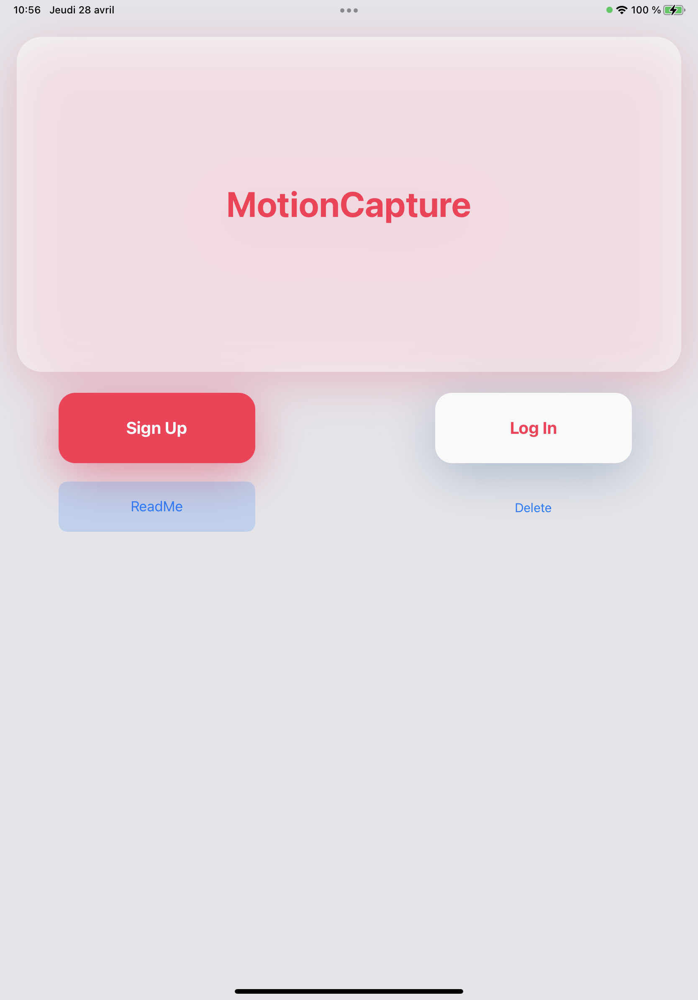
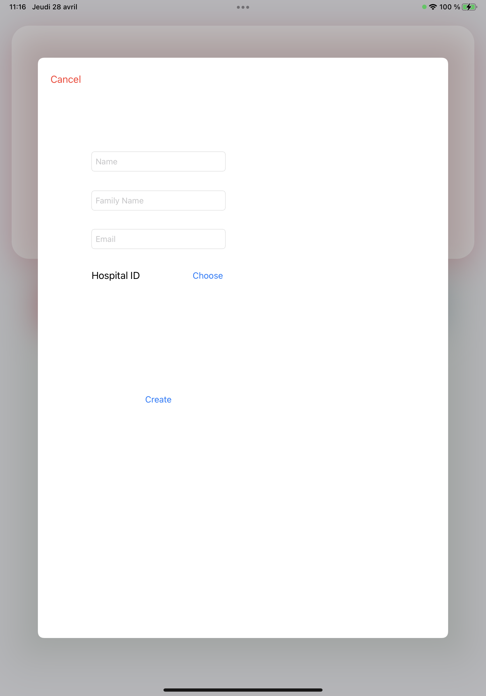
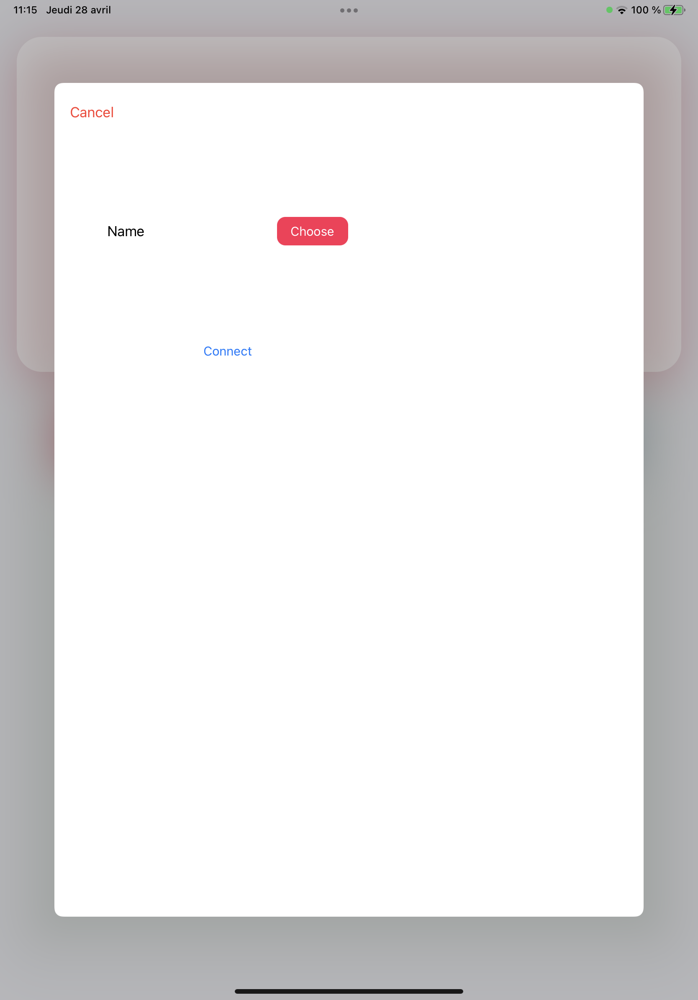
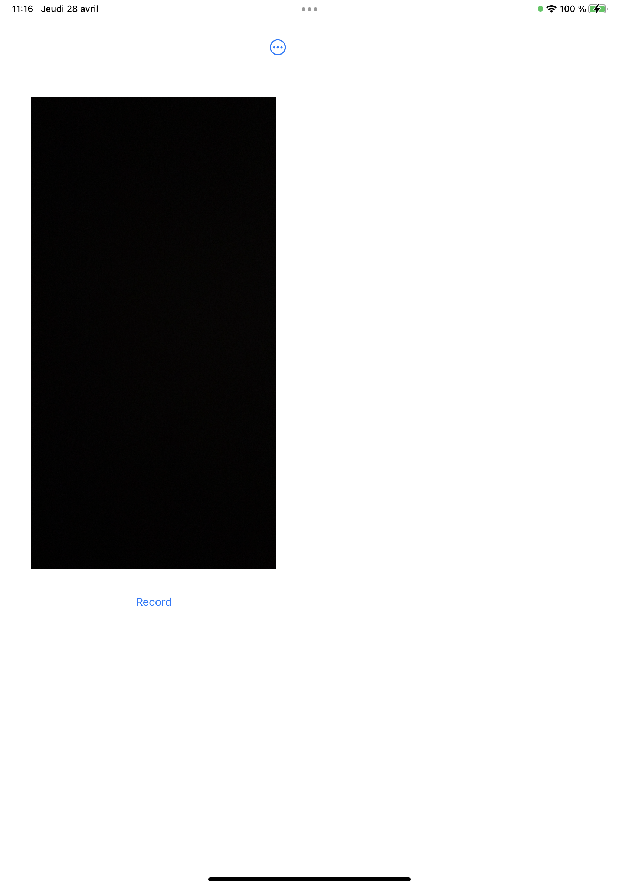
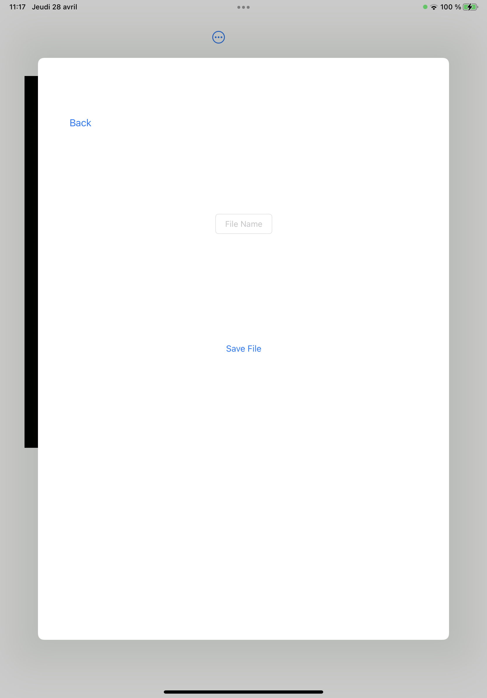
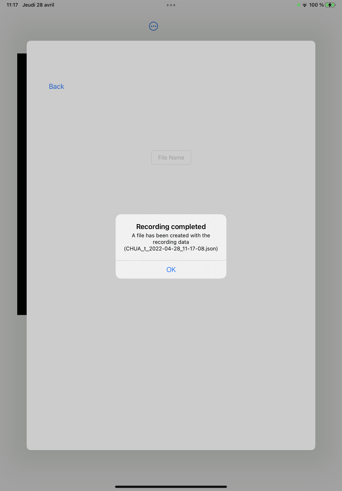
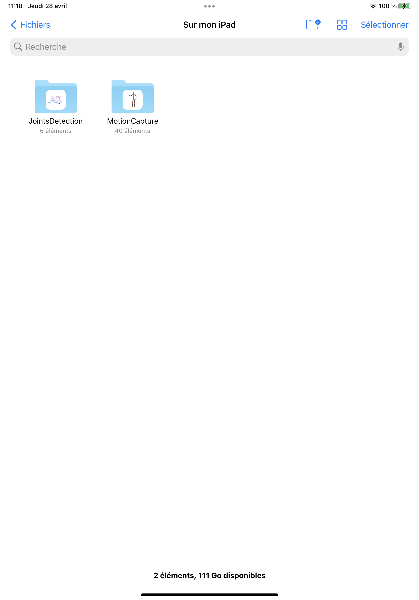

# revert-gait-app
## :file_folder: JointsDetection
#### Content
Simple ARKit Motion Capture app with custom joints (not a .usdz model) and the ability to save the capture to a [JSON file](#json).

## :file_folder: MotionCapture
#### Content
Skeleton of the main app with the possibility of creating accounts, logging in.
The ARKit fonctionalities of the *JointsDetection* file has veend implemented with also the ability to capture and save the [JSON file](#json).
The file is saved localy and can be interpreted by the local web page from the *JSON_Replay* folder. There's no interactions with any server.
#### To be done
- Responsive design (Only a responsive draft has been done)
- Front / Visual update
- Update the ReadMe part on the app

## :file_folder: JSON_Replay

#### Content
The Actual html page that allows you to visualize the animation from the json file you selected with 2 examples of json files.

#### To be done
- Change joint's color to put the same one for linked parts (same color for legs, arms etc)
- Design
---

## <a name="json">Json File</a>

The json file stored will be formatted as below:

`{"left_arm_joint":"SIMD3<Float>(3.0785291, -0.25033885, -1.3832895)",`  
`"right_leg_joint":"SIMD3<Float>(2.9378242, -1.1668019, -1.7644181)",`  
`"right_forearm_joint":"SIMD3<Float>(3.1559336, -0.50382257, -1.9025705)",`  
`"left_hand_joint":"SIMD3<Float>(3.0273547, -0.7497322, -1.3139629)",`  
`"neck_1_joint":"SIMD3<Float>(3.0849392, -0.1855591, -1.6111912)",`  
`"left_forearm_joint":"SIMD3<Float>(3.1317558, -0.5029015, -1.3188528)",`  
`"spine_7_joint":"SIMD3<Float>(3.0963707, -0.3192793, -1.6120651)",`  
`"bodyPosition":"SIMD3<Float>(3.1054263, -0.7540224, -1.6184782)",`  
`"right_foot_joint":"SIMD3<Float>(3.034734, -1.6137359, -1.758758)",`  
`"right_arm_joint":"SIMD3<Float>(3.1007771, -0.25169337, -1.8380563)",`  
`"spine_3_joint":"SIMD3<Float>(3.1130443, -0.6425201, -1.6183548)",`  
`"left_foot_joint":"SIMD3<Float>(3.0804262, -1.6259058, -1.5105062)",`  
`"bodyOrientation":"simd_quatf(real: 0.70038986, imag: SIMD3<Float>(-0.017917393, -0.71336555, -0.015573114))",`  
`"root":"SIMD3<Float>(3.104365, -0.75497556, -1.6187183)",`  
`"right_hand_joint":"SIMD3<Float>(3.0654051, -0.7553434, -1.9221685)",`  
`"left_leg_joint":"SIMD3<Float>(2.9703524, -1.1822366, -1.4956207)",`  
`"head_joint":"SIMD3<Float>(3.0190992, -0.04647702, -1.6380798)",`  
`"spine_5_joint":"SIMD3<Float>(3.116987, -0.5190891, -1.6164861)",`  
`"hips_joint":"SIMD3<Float>(3.1043365, -0.7572989, -1.618672)"}`

As you can see, in the json there is a key that correspond to the joint tracked wich is associated with 3 number that correspond to the position in space on this joint.

***(This format may change in the future)***

---
### Screenshots (not definitive design)

#### <a name="main">Main Menu</a>

This is the first menu you'll see after you launched the app.
In this menu you have differents choices which are: Sign Up, Log In, ReadMe, Delete
When you'll be connected, the app will automatically change the menu to the record one (see the [*Record Menu*](#record)).

Actions of every buttons on the Main Menu:
- Sign Up: Present the Sign up menu wich, as named, allows you to create a new account
- Log in: Present the Log in menu wich allows you to connect to your account
- ReadMe: The documentation about a normal running of the app
- Delete: Delete every person registered in the database (Has to be changed)

#### <a>Sign up Menu</a>

This menu is where you create your account.
Once you created it, a pop up will appear to tell you if your account has been sucsessfully created or not and then leaves you to the [*Main Menu*](#main).

Fields:
- Name
- Family Name
- Email
- Hospital ID

#### <a>Log in Menu</a>

In this menu, you can choose to connect in your account, if you already created it.
Once you're connected, the application will automatically redirect you to the [*Record Menu*](#record).

#### <a name="record"> Record Menu </a>

In the *Record Menu*, you can [record a video of your patient](#recordVideo)
Once you finished, the [*Save File Menu*](#save) will appear and you'll be able to save your video.
Moreover, on the top of the window, there's a drop-down menu in which you can choose to disconnect or go to your settings.

#### <a name="save"> Save Menu </a>

This menu appears after you recorded a video.
It makes you able to save the datas you recorded in a json files.
When you press the save button, it will be saved with the name you chose, if you didn't enter any name, the file will be save as Hospital_Medein_Date_Time.json and an [alert](#saveAlert) will pop.

#### <a name="saveAlert"> Save Alert </a>

After pressed the save button, this alert will pop to tell you that the file have been sucsessfully created and how it's named.

#### <a> Directory </a>

When your json file has been stored, you can find it in the application's directory.

### <a name="recordVideo">How to record a video</a>