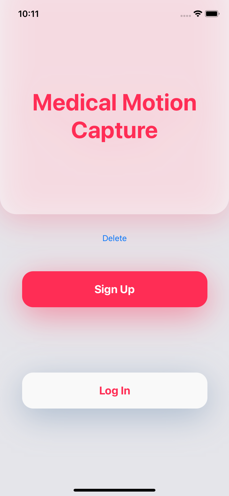
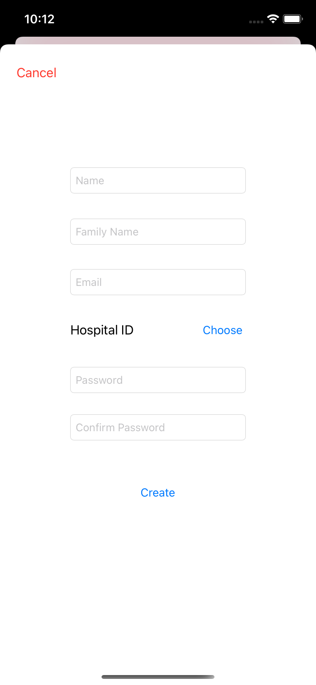
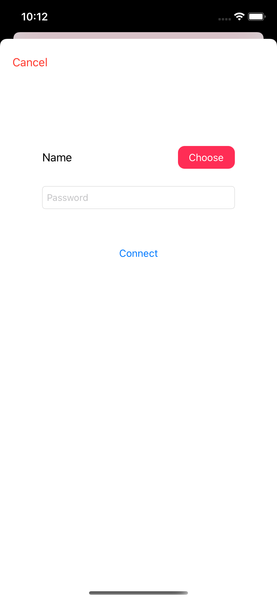
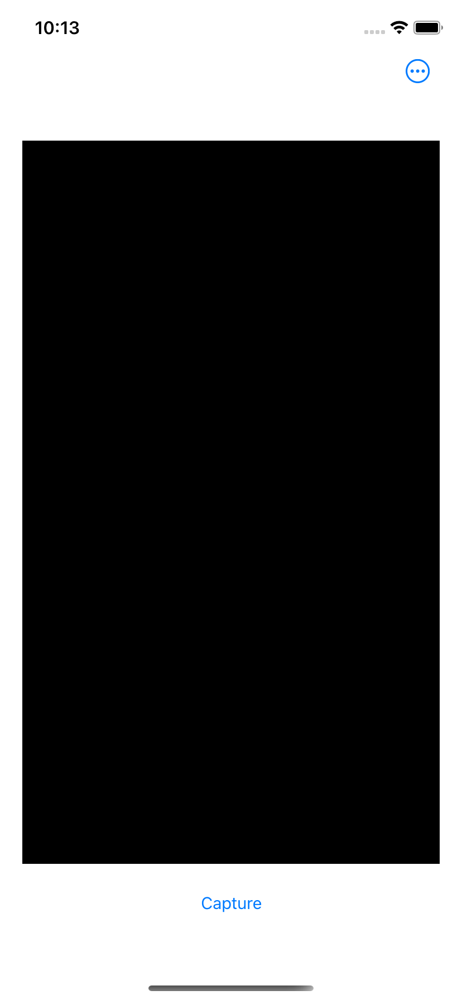
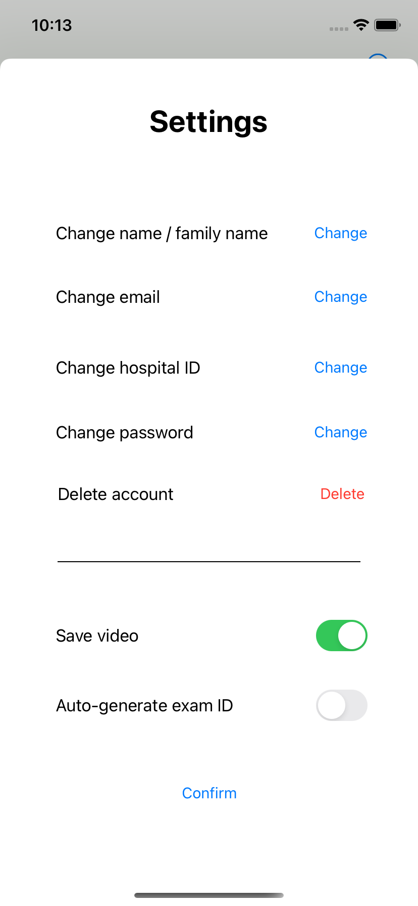
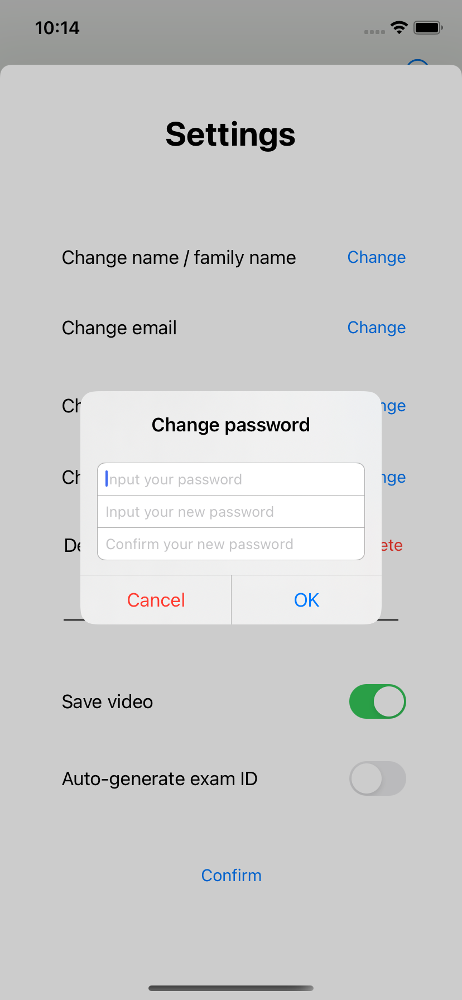

# revert-gait-app

## :file_folder: JointsDetection
#### Content
Simple Motion Capture app with custom joints (not a .usdz model) and the ability to save the capture to a JSON file.
#### To be done
- Async body detection (in order to remove the small lag at the beginning)
- More information in the JSON file (e.g. about the position of the camera?)
- Try to have vectors between the joints displayed on the screen
- Various code optimisations

## :file_folder: MotionCapture
#### Content
Skeleton of the main app with the possibility of creating accounts, logging in etc...
#### To be done
- ARKit implementation
- Addition and modification of features to meet the specifications
- Responsive design (only designed for iPhone screen format at the moment)
- Front / Visual update
#### Screenshots (not definitive design)
    
  
