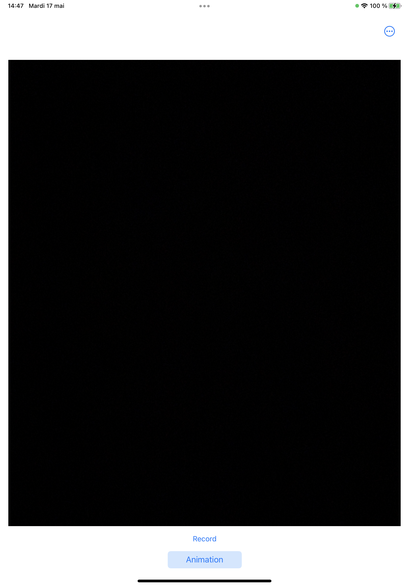
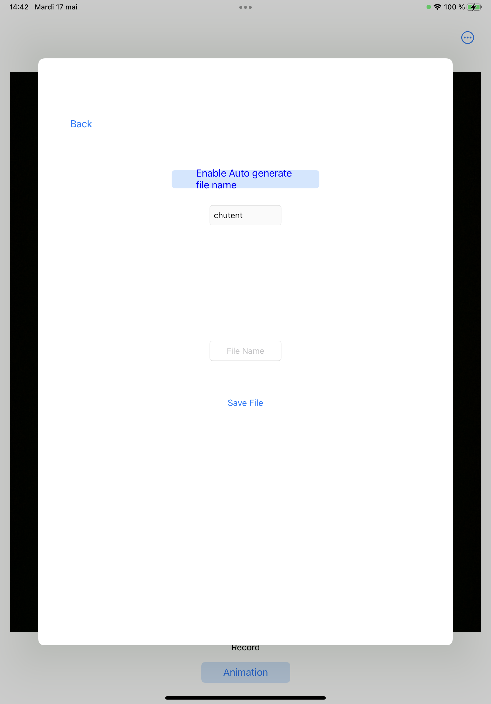
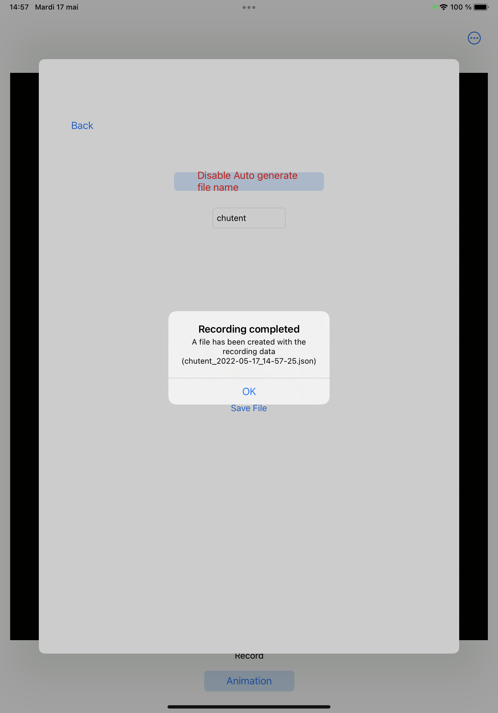
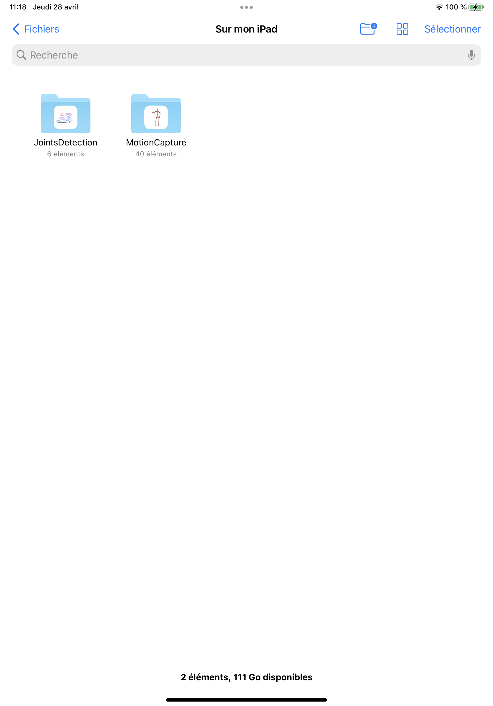
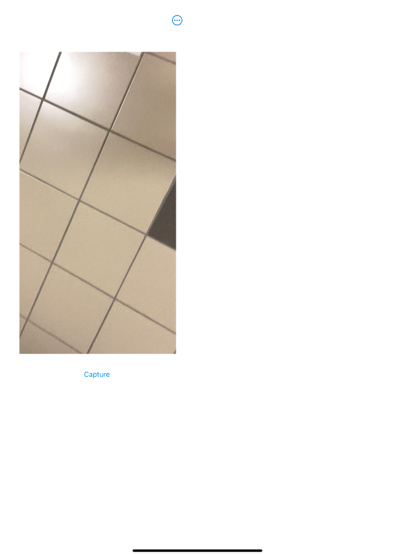
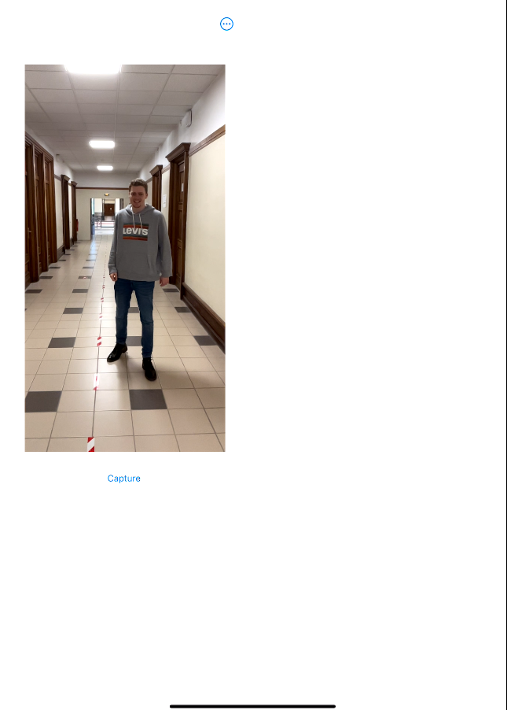
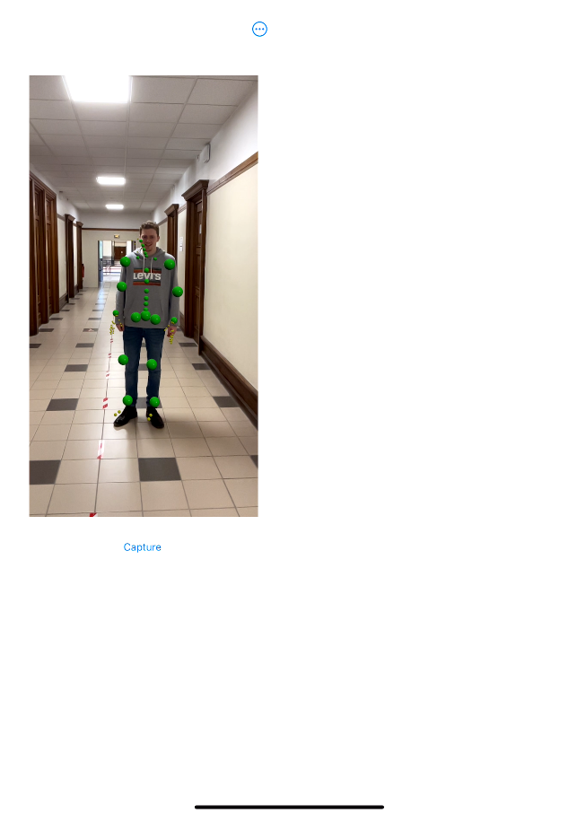

# revert-gait-app
## :file_folder: JointsDetection
#### Content
Simple ARKit Motion Capture app with custom joints (not a .usdz model) and the ability to save the capture to a [JSON file](#json).

## :file_folder: MotionCapture
#### Content
Skeleton of the main app with the possibility of creating accounts, logging in.
The ARKit fonctionalities of the *JointsDetection* file has been implemented with also the ability to capture and save the [JSON file](#json).
The file is saved localy and can be interpreted by the local web page from the [*JSON_Replay*](#replay) folder. There's no interactions with any server.
#### To be done
- Responsive design (Only a responsive draft has been done)
- Front / Visual update
- Update the ReadMe part on the app

## <a name="replay">Visualization</a>

#### Content
To see the animation of the json file you stored, you can just go to this [link](https://uartois-lml.github.io) then give your json to the website.

#### To be done
- Change joint's color to put the same one for linked parts (same color for legs, arms etc)
- Design
---

## <a name="json">Json File</a>

The json file stored will be formatted as below:

`{"left_arm_joint":"SIMD3<Float>(3.0785291, -0.25033885, -1.3832895)",`  
`"right_leg_joint":"SIMD3<Float>(2.9378242, -1.1668019, -1.7644181)",`  
`"right_forearm_joint":"SIMD3<Float>(3.1559336, -0.50382257, -1.9025705)",`  
`"left_hand_joint":"SIMD3<Float>(3.0273547, -0.7497322, -1.3139629)",`  
`"neck_1_joint":"SIMD3<Float>(3.0849392, -0.1855591, -1.6111912)",`  
`"left_forearm_joint":"SIMD3<Float>(3.1317558, -0.5029015, -1.3188528)",`  
`"spine_7_joint":"SIMD3<Float>(3.0963707, -0.3192793, -1.6120651)",`  
`"bodyPosition":"SIMD3<Float>(3.1054263, -0.7540224, -1.6184782)",`  
`"right_foot_joint":"SIMD3<Float>(3.034734, -1.6137359, -1.758758)",`  
`"right_arm_joint":"SIMD3<Float>(3.1007771, -0.25169337, -1.8380563)",`  
`"spine_3_joint":"SIMD3<Float>(3.1130443, -0.6425201, -1.6183548)",`  
`"left_foot_joint":"SIMD3<Float>(3.0804262, -1.6259058, -1.5105062)",`  
`"bodyOrientation":"simd_quatf(real: 0.70038986, imag: SIMD3<Float>(-0.017917393, -0.71336555, -0.015573114))",`  
`"root":"SIMD3<Float>(3.104365, -0.75497556, -1.6187183)",`  
`"right_hand_joint":"SIMD3<Float>(3.0654051, -0.7553434, -1.9221685)",`  
`"left_leg_joint":"SIMD3<Float>(2.9703524, -1.1822366, -1.4956207)",`  
`"head_joint":"SIMD3<Float>(3.0190992, -0.04647702, -1.6380798)",`  
`"spine_5_joint":"SIMD3<Float>(3.116987, -0.5190891, -1.6164861)",`  
`"hips_joint":"SIMD3<Float>(3.1043365, -0.7572989, -1.618672)"}`

As you can see, in the json there is a key that correspond to the joint tracked which is associated with 3 number that correspond to the position in space of this joint.

***(This format may change in the future)***

---
### Screenshots (not definitive design)

#### <a name="main">Main Menu</a>

This is the first menu you'll see after you launched the app.
In this menu you have different choices which are: *Record a Video* and *ReadMe*.
To record your video you'll have to press the *Record a video button* and you'll aslo be able to save your file (see the [*Record Menu*](#record)).

Actions of every buttons on the Main Menu:
- Record a Video: By pressing this button, the application will change the view and makes you able to record you video.
- ReadMe: The documentation about a normal running of the app

#### <a name="record"> Record Menu </a>

In the *Record Menu*, you can [record a video of your patient](#recordVideo).
Once you finished, the [*Save File Menu*](#save) will appear and you'll be able to save your video.
Moreover, on the top of the window, there's a drop-down menu in which you can back to the [*Main Menu*](#main).

#### <a name="save"> Save Menu </a>

This menu appears after you recorded a video.
It makes you able to save the datas you recorded in a json files.

You can choose between generate an auto file name or choose you own name.

- Auto generate file name:
  - When this option is activated, you file will ba named as, the hospital name you put plus the actual date (yyyy-mm-dd) and time (hh-mm-ss). 
  
    example: CHUA_2022-05-17_14-57-26.json
  - If you didn't put any name, an alert will pop to warn you that the field is empty.
  - When you saved the data will the name auto-generated, the next time you'll come to this view, the name will be pre-completed.
- Your file name:
  - Disabling the auto generate option will allow you to simply put the name you want for your file.
  - If you didn't put any name file, a pop up will appear to warn you.

Saving a file by enabling the auto generate option or not will be saved for the next save (you can change it whenever you want when you come back on this menu).

Once your file has been saved an [alert](#saveAlert) will pop to confirm the file name and that it has been created correctly.

#### <a name="saveAlert"> Save Alert </a>

After pressed the save button, this alert will pop to tell you that the file have been sucsessfully created and how it's named.

#### <a> Directory </a>

When your json file has been stored, you can find it in the application's directory.

---
### <a name="recordVideo">How to record a video</a>

#### Step 1

Firstly, you have to be on the [*Record menu*](#record) to record your video.

#### Step 2

Now that you're on this screen, you just need to aim to your patient.

#### Step 3

Now just wait a bit that the application can tracks the joints (it may cause a little freeze of the camera while it's loading).

When it's done, you can record your video by pressing the ***record*** button and stop it when you finished by pressing the ***Stop recording*** button. Then you'll be able to save your file in the [*Save File Menu*](#save).